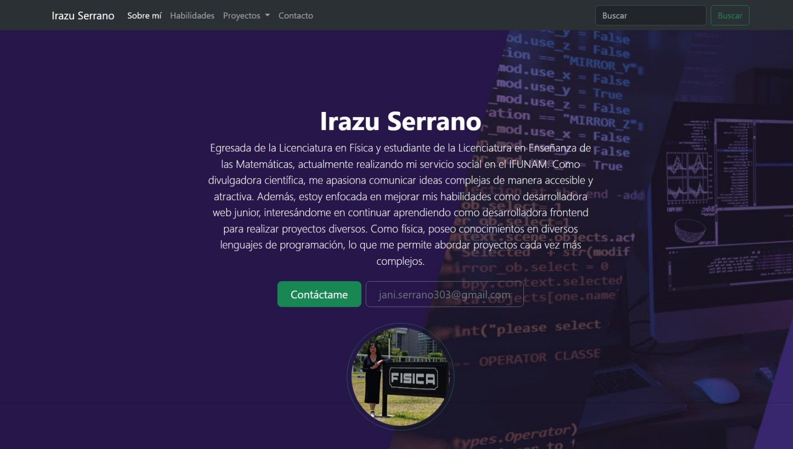

# Portafolio de habilidades - TECNOLOCHICAS PRO

El presente proyecto es un portafolio realizado y desarrollado para poner en práctica las habilidades obtenidas dentro del Bootcamp de Desarrollo Frontend de Tecnolochicas PRO 2024.

Fue desarrollado con HTML, CSS y JS; con el uso del framework de UI, Bootstrap utilizando además bibliotecas externas.

La página es responsiva (adaptable a diferentes tamaños de pantalla) e incluye la presentación de la autora del proyecto.

[Proyecto desplegado](https://portafolio-b7-g2-supn.vercel.app/#)

## Secciones de mi sitio

- Sobre mí

- Habilidades
- Conocimientos en
- Proyectos
- Testimonios
- Contactos 

## Tecnologías

* HTML
* CSS
* Bootstrap
* JavaScript

---

Desarrollado por Irazu Serrano en [Tecnolochicas PRO](https://tecnolochicas.mx).